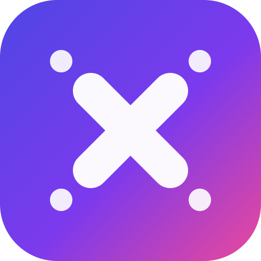

<div align="center">



# 🎯 Çarpım Tablosu Macerası ✖️

**Çocuklar için sesli, puanlı, mobil uyumlu çarpım tablosu öğrenme oyunu.**

[](https://carpim-tablosu.mlakin.workers.dev)


</div>

---

## ✨ Özellikler

| | |
|---|---|
| 👤 **Kişisel** | Çocuk adını yazar, oyun ona hitap eder |
| 🎲 **Karışık mod** | 1–10 arası tüm tablolardan karışık sorular |
| 🔢 **Belirli tablo** | Örn. 9'ları seçince **Sıradan** (9×1, 9×2…) veya **Karışık** sorar |
| 🔊 **Sesli + görsel** | Her soru Türkçe seslendirilir *ve* ekrana yazılır ("tekrar dinle", ses aç/kapat) |
| ⭐ **Ödül sistemi** | Puan, yıldız, seri (streak), konfeti ve rozetler |
| 🚪 **Çıkış** | Soru sırasında istediğin an menüye dönebilme |
| 🏆 **Lider tablosu** | Skorlar Cloudflare D1'de saklanır, en iyiler listelenir |
| 📱 **PWA** | Telefonda/tablette "Ana ekrana ekle" ile uygulama gibi çalışır, çevrimdışı açılır |
| 📐 **Responsive** | Büyük dokunmatik tuş takımı; telefon, tablet, bilgisayar uyumlu |

---

## 🕹️ Nasıl oynanır?

```
Adını yaz  →  Mod seç (Karışık / bir tablo)  →  (tablo ise) Sıradan mı Karışık mı?
           →  Soruları çöz (sesli + ekranda)  →  Puan & yıldız kazan  →  🏆 Lider tablosu
```

---

## 🧱 Mimari

```
Tarayıcı (PWA)
   │  fetch /api/scores
   ▼
Cloudflare Worker  ──►  D1 Veritabanı (skorlar)
   │
   └──►  Statik dosyalar (public/)
```

| Dosya | Görevi |
|---|---|
| `public/index.html` | Tüm oyun: arayüz, ses, puan, yerel kayıt |
| `public/manifest.webmanifest` · `public/sw.js` | PWA: yüklenebilirlik + çevrimdışı önbellek |
| `public/icon-*.png` | Uygulama ikonları |
| `worker.js` | Cloudflare Worker: `/api/scores` (D1) + statik sunum |
| `schema.sql` | D1 tablo şeması |
| `wrangler.toml` | Worker + D1 + statik varlık ayarları |

**Teknoloji:** Saf HTML/CSS/JS (çerçeve/derleme yok) · Web Speech API (seslendirme) · Cloudflare Workers + D1.

---

## 🚀 Kendi hesabınızda yayınlama

Gereken: [Node.js](https://nodejs.org) ve bir Cloudflare hesabı.

**1. Bağımlılık yok** — doğrudan `npx wrangler` kullanılır.

**2. D1 veritabanını oluşturun:**
```bash
npx wrangler d1 create carpim_tablosu
```
Çıktıdaki `database_id` değerini `wrangler.toml` içine yazın.

**3. Tabloyu oluşturun:**
```bash
npx wrangler d1 execute carpim_tablosu --remote --file=./schema.sql
```

**4. Yayınlayın:**
```bash
npx wrangler deploy
```

> **Kimlik doğrulama:** `npx wrangler login` (tarayıcıdan) **veya** ortam değişkenleri ile:
> ```bash
> export CLOUDFLARE_API_TOKEN="KENDI_TOKENINIZ"      # D1 + Workers Scripts (Edit) izinli
> export CLOUDFLARE_ACCOUNT_ID="KENDI_HESAP_IDNIZ"
> ```

### Yerel geliştirme
```bash
npx wrangler dev        # http://localhost:8787 (yerel D1 ile)
```
Sadece arayüzü görmek isterseniz `public/index.html` dosyasına çift tıklamanız yeterli (lider tablosu pasif olur; skorlar yalnızca cihazda tutulur).

### Veritabanı işlemleri
```bash
npx wrangler d1 execute carpim_tablosu --remote --command "SELECT * FROM scores;"
npx wrangler d1 execute carpim_tablosu --remote --command "DELETE FROM scores;"   # sıfırla
```

---

## 🔒 Güvenlik

- 🔑 **Hiçbir API anahtarı kodda yer almaz.** D1'e "binding" ile erişilir; token yalnızca deploy sırasında ortam değişkeni olarak kullanılır.
- 🚫 `.gitignore`, `.wrangler/`, `.dev.vars` ve `node_modules/` klasörlerini dışarıda tutar — sırlar repoya girmez.
- ✅ API girişleri sunucu tarafında doğrulanır ve sınırlanır (isim uzunluğu, sayısal aralıklar) — SQL sorguları parametrelidir.

---

## 📄 Lisans

MIT — bkz. [LICENSE](LICENSE). Dilediğiniz gibi kullanın, geliştirin, paylaşın.

<div align="center">
<sub>❤️ ile çocuklar için yapıldı.</sub>
</div>
